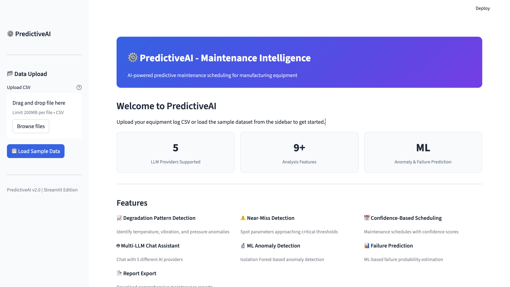
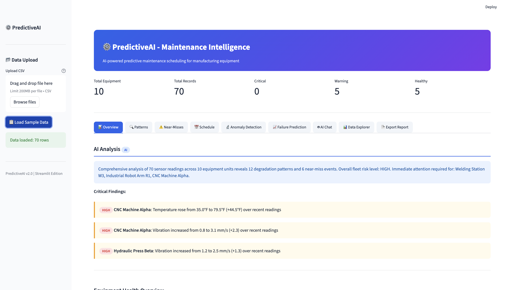
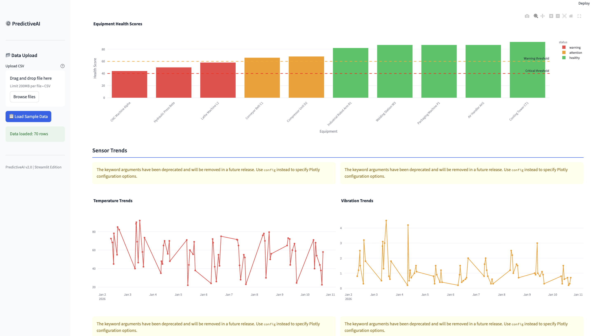

🚀 Nexara-AI - Maintenance Intelligence

Nexara-AI is an AI-powered predictive maintenance dashboard for industrial equipment.
Built with Python and Streamlit, it combines rule-based analytics, machine learning, and LLM-powered insights to detect failures early and optimize maintenance scheduling.

⸻

✨ Key Features
	•	📈 Degradation Pattern Detection
Detect temperature, vibration, and pressure anomalies from equipment logs.
	•	⚠️ Near-Miss Detection
Identify parameters approaching critical thresholds before failures occur.
	•	🤖 AI Analysis Engine
LLM-powered insights with fallback rule-based reasoning.
	•	💬 AI Chat Assistant
Ask questions about equipment health, anomalies, and schedules.
	•	🔬 ML Anomaly Detection
Uses Isolation Forest for detecting unusual patterns.
	•	📊 Failure Prediction
Predict probability of machine failure.
	•	📅 Maintenance Scheduling
Generate prioritized maintenance plans with confidence scores.
	•	📄 Report Generation
Export human-readable reports (DOCX-ready).
	•	📊 Interactive Dashboard
Visualizations using Plotly inside Streamlit.

⸻

## 📸 Screenshots

### Dashboard

### Home Page

### More View

⸻

🛠️ Installation

1. Clone Repository

git clone https://github.com/ShyamMurodiya/Nexara-AI.git
cd Nexara-AI

⸻

2. Create Virtual Environment

python -m venv .venv

Activate:

Mac/Linux

source .venv/bin/activate

Windows

.venv\Scripts\activate

⸻

3. Install Dependencies

pip install -r requirements.txt

⸻

⚙️ Configuration (Optional)

Create a .env file for AI features:

cp .env.example .env

Add your API key:

HUGGINGFACE_API_KEY=your_key_here

⸻

▶️ Run the Project

streamlit run app.py

⸻

🌐 Access App

After running:

http://localhost:8501

⸻

📊 How to Use
	1.	Upload your equipment CSV file
	2.	Or click “Load Sample Data”
	3.	Explore:
	•	Dashboard
	•	Patterns
	•	Near-Misses
	•	ML Anomalies
	•	Maintenance Schedule
	4.	Use AI Chat for insights

⸻

📁 Project Structure

Nexara-AI/
├── app.py
├── ai_engine.py
├── ml_features.py
├── pattern_detector.py
├── llm_provider.py
├── dataset/
│   └── sample_logs.csv
├── assets/                # Screenshots go here
├── requirements.txt
├── README.md
└── .env.example

⸻

🧪 Testing

pytest

or

python test_full.py

⸻

⚠️ Notes
	•	LLM features require API keys
	•	Without API → fallback rule-based logic
	•	Do NOT upload .venv or .env

⸻

🔮 Future Improvements
	•	PDF/DOCX export
	•	Real-time IoT integration
	•	Cloud deployment (Streamlit Cloud / Docker)
	•	Advanced ML models

⸻

🤝 Contributing

Pull requests are welcome.
For major changes, open an issue first.

⸻

📄 License

MIT License

⸻

👨‍💻 Author

Shyam Murodiya
GitHub: https://github.com/ShyamMurodiya
:::